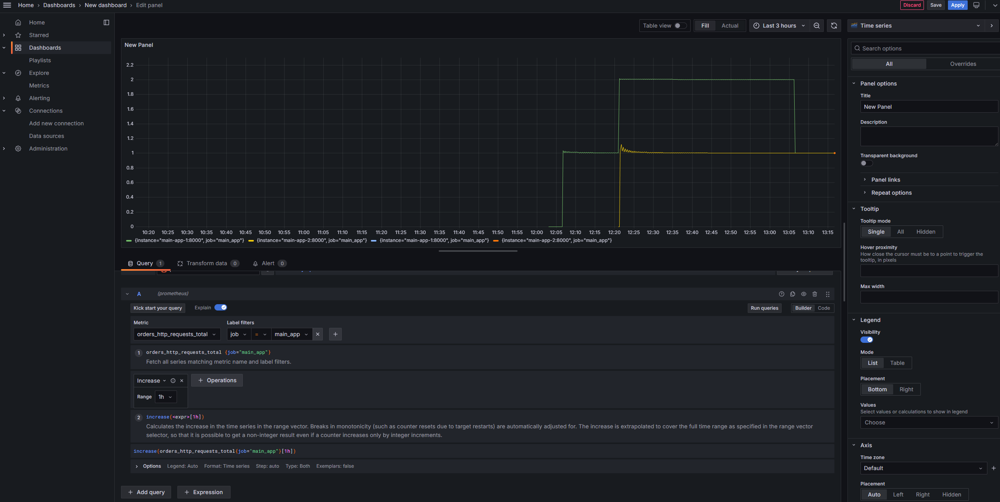
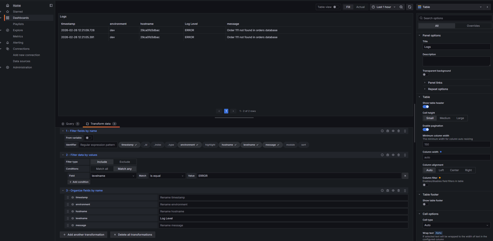

# Практическое задание 8

## Дано

Пример **docker-compose.yml** с основным приложением и вспомогательным, а также сборщиком логов *fluentd*. Пример **docker-compose-infra.yml** c сервисами *rmq, redis, postgres, zookeeper, haproxy, minio, opensearch+dashboard, prometheus, grafana.* Примеры **докерфайлов**

## Задание

- Сделать новые **docker-compose.yml** для сервисов, либо “довести до ума” данные в примере до полноценного вида
- Убедиться, что приложение экспортирует метрики и **Prometheus** их собирает
- Сделать свою кастомную метрику (в идеале продуктовую). Если есть умение/желание/возможность - добавить ее в код, подключить к **Prometheus**, визуализировать в **Grafana**. Если сложно, то простой вариант - просто “описать” словами свое видение ее (для чего нужна, что замеряем, как группируем, фильтруем и тд)
- Подключить в **Grafana** оба источника и самостоятельно сделать дашборд, содержащий любые метрики на выбор (отличные от кастомной из готового примера) и логи приложения из **Opensearch** (одновременно или разные дашборды)
- \*Попробовать подключить любой инфраструктурный сервис к **Prometheus**
- \*Попробовать добавить алерты (**Prometheus** или **Grafana**)

## Проверка результата

- На http://адрес-приложения/metrics видны метрики Prometheus, дефолтные и кастомная
- В веб-панели Прометея есть оба таргета и оба “здоровы”
- В Графане добавлены оба источника *(Data sources - Add new*)
- Создан дашборд минимум из двух элементов (по одному на источник). Последовательность действий: в *Explore* выбрать источник, выбрать тип данных (конкретная метрика(и) для Прометея или *Raw data* для логов), осуществить любые трансформации (*Operations* для метрик, *Transform data* для логов)

## Отчетность

- файл `docker-compose.yml`
- файл `docker-compose-infra.yml`
- Код приложения, если он отличается от примера по умолчанию
- Если метрика только придумана но не реализована, текстовый файл с ее описанием
- Скриншот готового дашборда в Grafana