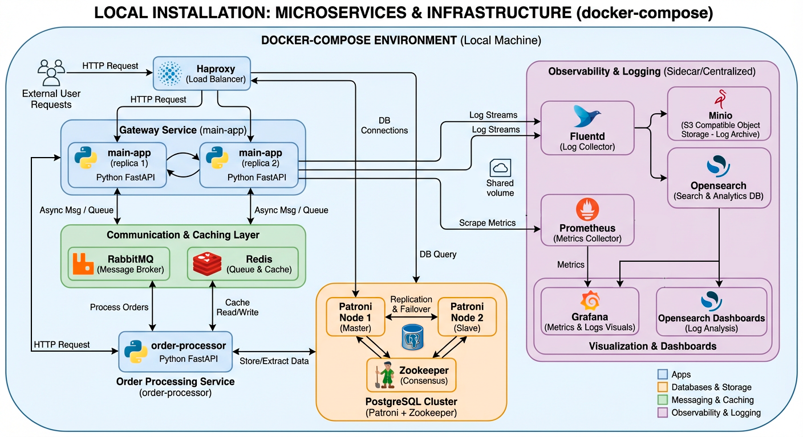

# Описание проекта

Данный проект представляет собой систему обработки заказов, реализованную как набор микросервисов с использованием современных технологий для обеспечения высокой доступности, масштабируемости и мониторинга.

## Архитектура

Основные компоненты системы:

- **main-app** (2 реплики) — gateway-сервис, через который проходят все внешние запросы.
- **order-processor** — микросервис для обработки заказов: создание заказов, хранение в базе данных, извлечение информации.
- **PostgreSQL кластер** с использованием Patroni и Zookeeper для обеспечения отказоустойчивости (мастер-слейв с двумя нодами).
- **HAProxy** — балансировщик нагрузки, распределяющий запросы между репликами main-app и нодами Patroni.
- **RabbitMQ** — система обмена сообщениями для взаимодействия микросервисов.
- **Redis** — используется для очередей между микросервисами и кэширования данных между order-processor и PostgreSQL.
- **Fluentd** — sidecar-контейнер для сбора логов из микросервисов, их отправки в Opensearch и архивирования в Minio (S3).
- **Opensearch + Dashboards** — платформа для поиска и визуализации логов.
- **Minio** — хранилище архивов логов в формате S3.
- **Prometheus** — сбор и хранение метрик с микросервисов.
- **Grafana** — визуализация данных из Opensearch и Prometheus

### Детали компонентов

- **main-app**:
  - Запущен в двух репликах для высокой доступности.
  - Балансировка запросов через HAProxy.
  
- **order-processor**:
  - Основной функционал по обработке и хранению заказов.
  - Обменивается сообщениями с main-app через RabbitMQ и Redis.
  
- **PostgreSQL с Patroni и Zookeeper**:
  - Обеспечивает отказоустойчивость реплики базы данных.
  - Две ноды с мастер-слейв конфигурацией.
  
- **HAProxy**:
  - Балансирует трафик между сервисами и нодами базы.
  
- **RabbitMQ и Redis**:
  - RabbitMQ для асинхронного взаимодействия микросервисов.
  - Redis используется как очередь и для кэширования данных.
  
- **Fluentd + Opensearch + Minio**:
  - Fluentd собирает логи из двух микросервисов.
  - Отправляет логи в Opensearch и архивирует в Minio.
  - Opensearch обеспечивает поиск и визуализацию логов.
  - Minio используется для долговременного хранения архивов.

- **Prometheus**:
  - Сбор метрик с микросервисов для мониторинга и алертинга.

- **Grafana**:
    - Дашборды с логами из Opensearch и метриками из Prometheus

## Запуск и деплой

Для запуска оснвного сервиса используется `docker-compose.yml`, для запуска инфраструктурных сервисов - композ файлы в директории `infra/`. 

### Порядок запуска:
1. infra/docker-compose-storage.yml
2. infra/docker-compose-comm.yml
3. infra/docker-compose-visual.yml
4. docker-compose.yml